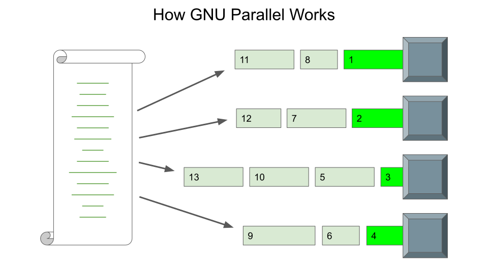

GNU Parallel
============

`Français <../fr/gnu_parallel.html>`_

If your research project involves doing parameter sweeps with short processes
(50 minutes or less), a multitude of Slurm jobs is probably `not the best
solution <#why-not-slurm>`_. In fact, having to manage multiple parameter
combinations is a challenge in itself. And this is where `GNU Parallel
<https://docs.alliancecan.ca/wiki/GNU_Parallel>`__ becomes the ideal tool.

GNU Parallel is used via the ``parallel`` command, which allows you to fully
utilize a compute node's local resources by managing the execution of a **long
list of small tasks**. It is a bit like the Slurm scheduler, but on a smaller
scale and managing processes instead of job scripts.

Why not Slurm?
--------------

OK, but why not just submit **hundreds of jobs to Slurm**?

- At any given time, Slurm **limits each user to 1000 jobs** in total in
  ``squeue`` (*pending* + *running*).
- Certain compute tasks are so **short (less than 5 minutes)** that the time to
  properly start and end the corresponding jobs individually would
  significantly reduce their global efficiency.

GNU Parallel advantages:

- **No need to use a loop**, which makes it easier to manage hundreds of
  compute tasks.
- The number of **available CPU cores automatically limits** the number of
  simultaneous running tasks.

  - For a set of parallel tasks, it is possible to specify a smaller number of
    processes than the number of CPU cores.

- GNU Parallel can `resume the sequence of compute tasks
  <https://docs.alliancecan.ca/wiki/GNU_Parallel#Keeping_Track_of_Completed_and_Failed_Commands,_and_Restart_Capabilities>`__
  in case a job is interrupted.

GNU Parallel command syntax
---------------------------

The main basic elements of a ``parallel`` command are:

.. code-block:: bash

    parallel <options> <command template> ::: <list of values>

See the manual page for options (press :kbd:`q` to exit):

.. code-block:: bash

    man parallel

One sequence of parameter values
--------------------------------

The default placeholder for the changing parameter is ``{}``. For example:

.. code-block:: bash
    :emphasize-lines: 1,10-15

    [alice@narval1 ~]$ parallel echo file{}.txt ::: 7 8 9 10 11 12
    Academic tradition requires you to cite works you base your article on.
    If you use programs that use GNU Parallel to process data for an article in a
    scientific publication, please cite:

    ...

    To silence this citation notice: run 'parallel --citation' once.

    file7.txt
    file8.txt
    file10.txt
    file11.txt
    file9.txt
    file12.txt

As seen in this example, the order in which the results are displayed may vary
due to the execution of different processes simultaneously: their duration may
vary and the operating system may sometimes slightly favor certain processes.

.. note::

    To commit to citing the developers of GNU Parallel:

    .. code-block:: bash
        :emphasize-lines: 1,9

        [alice@narval1 ~]$ parallel --citation
        Academic tradition requires you to cite works you base your article on.
        If you use programs that use GNU Parallel to process data for an article in a
        scientific publication, please cite:

        ...

        Type: 'will cite' and press enter.
        > will cite

        ...

        It is really appreciated. The citation notice is now silenced.

The first command can be rewritten using the ``{a..b}`` *brace expansion*:

.. code-block:: bash

    [alice@narval1 ~]$ parallel echo file{}.txt ::: {7..12}
    file7.txt
    file8.txt
    file9.txt
    file10.txt
    file11.txt
    file12.txt

If necessary, leading zeros can be added to shorter numbers:

.. code-block:: bash

    [alice@narval1 ~]$ parallel echo file{}.txt ::: {07..12}
    file07.txt
    file08.txt
    file09.txt
    file10.txt
    file11.txt
    file12.txt

The same value can be repeated in the command template:

.. code-block:: bash

    [alice@narval1 ~]$ parallel echo {}. file{}.txt ::: {07..12}
    07. file07.txt
    08. file08.txt
    09. file09.txt
    10. file10.txt
    11. file11.txt
    12. file12.txt

Finally, if your command template contains characters normally interpreted by
Bash, for example ``$``, ``|``, ``>``, ``&`` and ``;``, you can enclose the
entire command template in ``''`` so that the interpretation of these
characters is done only when GNU Parallel executes the commands in parallel:

.. code-block:: bash

    [alice@narval1 ~]$ parallel 'echo {}. > $SCRATCH/file{}.txt' ::: {07..12}
    [alice@narval1 ~]$ cat $SCRATCH/file*.txt
    07.
    08.
    09.
    10.
    11.
    12.

Exercise - Prepare DNA sequences
''''''''''''''''''''''''''''''''

**Objectives**

- Transform loops into calls to the ``parallel`` command.
- Prepare the dataset: random DNA sequences.

**Instructions**

#. Go to the exercise directory with ``cd
   ~/cq-formation-cip202-main/lab/bio-info``.
#. Edit the ``gen-seq.sh`` file:

   #. Request two (2) CPU cores in the ``SBATCH`` header.
   #. Transform the ``python gen_spec.py ...`` command to use the ``parallel``
      command instead of the ``for`` loop:

      #. Add ``parallel`` at the beginning and remove the indentation.
      #. Replace both ``$spec`` iterators with ``{}``.
      #. Protect the ``>`` character with quotes, if applicable.
      #. Add ``:::``, and the letters A to D inclusive.

   #. Repeat the same steps for the ``makeblastdb ...`` command.
   #. Repeat the same steps for the ``python gen_test.py ...`` command,
      but with the following differences:

      - Replace both ``$test`` iterators with ``{}``.
      - Provide the 16 letters from K to Z inclusive.

   #. Remove the lines ``for`` and ``done`` (:kbd:`Ctrl+K` in ``nano``).

#. Save the script and submit it to the scheduler.
#. Once the job is over, validate the presence of the following files:

   - ``spec_A.fa`` to ``spec_D.fa`` inclusive.
   - ``spec_A.n*`` to ``spec_D.n*`` inclusive.
   - ``chr_K.fa`` to ``chr_Z.fa`` inclusive.

.. note::

    The digital encoding of DNA strands is done with the four codes ``A``,
    ``C``, ``G`` and ``T``, which correspond to the four bases of the DNA
    molecules. Although a complete DNA sequence can contain millions of bases,
    sequencers are only reliable on short readings. Thus, a collection of Fasta
    files (``*.fa``) contains many pieces of DNA that can overlap. However,
    given the many possible combinations, in addition to a certain rate of
    errors in the data, reconstructing a long sequence of DNA is a whole
    challenge!

    Sometimes the problem is *simpler*, meaning that you just need to identify
    which species the DNA strand belongs to. In this case, you just need to
    test the unknown strands against databases of known sequences. This is
    essentially what was prepared in this exercise.

Multiple combinations of parameter values
-----------------------------------------

For this part, go to the examples directory with:

.. code-block:: bash

    cd ~/cq-formation-cip202-main/lab/gnu-parallel

**a)** When there are **multiple parameter sequences to combine**, numbered
pairs of braces such as ``{1}``, ``{2}``, etc. can be used:

.. code-block:: bash

    [alice@narval1 gnu-parallel]$ parallel echo file{1}{2}.txt ::: {08..10} ::: a b
    file08a.txt
    file08b.txt
    file09a.txt
    file09b.txt
    file10a.txt
    file10b.txt

**b)** In the case where the **parameter combinations are found in a text
file**:

.. code-block:: bash

    [alice@narval1 gnu-parallel]$ cat param.txt
    3 4
    3 6
    3 8
    5 4
    5 6
    5 8
    7 4
    7 6
    7 8

The ``parallel`` command will have ``-C ' '`` to specify the parameter
separator in ``param.txt``, as well as the ``::::`` argument to then specify
this filename:

.. code-block:: bash
    :emphasize-lines: 7

    [alice@narval1 gnu-parallel]$ cat exec-param.sh
    #!/bin/bash
    #SBATCH --cpus-per-task=2
    #SBATCH --mem=1000M
    #SBATCH --time=00:05:00

    parallel -C ' ' echo '$(({1}*{2})) > prod_{1}x{2}' :::: param.txt
    grep -E '[0-9]+' prod_*

.. code-block:: bash

    [alice@narval1 gnu-parallel]$ sbatch exec-param.sh

**c)** If you prefer to validate the **list of commands in a text file**
before executing them on a compute node:

.. code-block:: bash

    [alice@narval1 gnu-parallel]$ cat cmd.txt
    echo $((3*4)) > prod_3x4
    echo $((3*6)) > prod_3x6
    echo $((5*4)) > prod_5x4
    echo $((5*6)) > prod_5x6
    echo $((5*8)) > prod_5x8
    echo $((7*6)) > prod_7x6
    echo $((7*8)) > prod_7x8

The job script will have a simplified ``parallel`` command:

.. code-block:: bash
    :emphasize-lines: 7

    [alice@narval1 gnu-parallel]$ cat exec-cmd.sh
    #!/bin/bash
    #SBATCH --cpus-per-task=2
    #SBATCH --mem=1000M
    #SBATCH --time=00:05:00

    parallel < cmd.txt
    grep -E '[0-9]+' prod_*

.. code-block:: bash

    [alice@narval1 gnu-parallel]$ sbatch exec-cmd.sh

Exercise - Aligning DNA sequences
'''''''''''''''''''''''''''''''''

Given DNA sequences from four known species ``{A,B,C,D}`` and 16 unknown
species ``{K,L,M,N,O,P,Q,R,S,T,U,V,W,X,Y,Z}``, we want to identify the unknown
species by using bioinformatics tools to compare their DNA to that of the known
species. The match is assessed using DNA strand alignments. For example, one
alignment found looks like this:

.. code-block::

    Query  1    GTCTGTGTAATGCGCACCATCCGTGATATAATCGACGACGGCCTCCAAGAGACAAGGGCG  60
                |||||||||||||||||||||||||||||||  |||||||||||||||||||||||| ||
    Sbjct  637  GTCTGTGTAATGCGCACCATCCGTGATATAACTGACGACGGCCTCCAAGAGACAAGGCCG  696

    Query  61   GCCATAAGGCGTGCACTATCTCAAAGCTGGTAATGTGAAGAAACCTATAAAAAGAGTACA  120
                |||||||||||||||| |||||||||| ||| ||||||||||||||| ||||||||||||
    Sbjct  697  GCCATAAGGCGTGCACAATCTCAAAGCAGGTCATGTGAAGAAACCTACAAAAAGAGTACA  756

By testing the correspondence of all combinations ``{A,B,C,D}`` x
``{K,L,M,N,O,P,Q,R,S,T,U,V,W,X,Y,Z}``, we obtain 64 combinations to test.

**Objective**

- Use two lists of values in a ``parallel`` command.

**Instructions**

#. Go to the exercise directory with ``cd
   ~/cq-formation-cip202-main/lab/bio-info``.

   #. Validate the presence of the following files:

      - ``spec_A.fa`` to ``spec_D.fa`` inclusive.
      - ``spec_A.n*`` to ``spec_D.n*`` inclusive.
      - ``chr_K.fa`` to ``chr_Z.fa`` inclusive.

   #. **If any are missing**, submit the following script to the scheduler:
      ``sbatch solution/gen-seq.sh``.

#. Edit the ``blastn-parallel.sh`` file:

   #. Request four (4) CPU cores in the ``SBATCH`` header.
   #. Separate the command template and both lists of values with ``:::``
      separators.
   #. The first list of letters corresponds to known species. Each letter is
      used as a **suffix** to the database name ``spec_*`` and the output
      file name ``results/align_*_*``.
   #. The second list of letters corresponds to unknown species. Each letter is
      used **in the middle** of the Fasta file name ``chr_*.fa`` and the output
      file name ``results/align_*_*``.

#. Save the script and submit it to the scheduler.
#. In the end, there should be 64 files in the ``results`` directory. Some are
   larger than others because alignments were found.

Nested multi-threaded parallelism
---------------------------------

For multi-threaded calculations, the ``parallel`` command must not launch as
many processes as there are CPU cores allocated to the job: there would be
multiple threads per CPU core. The number of processes must instead be limited
with the ``-P,--max-procs`` option.

For example, 10 cases to treat with a maximum of two processes in parallel:

.. code-block:: bash

    [alice@narval1 ~]$ parallel -P 2 'echo {} && sleep 3' ::: {1..10}
    # (3 seconds of waiting)
    1
    2
    # (3 seconds of waiting)
    3
    4
    # (3 seconds of waiting)
    5
    6
    # (3 seconds of waiting)
    7
    8
    # (3 seconds of waiting)
    9
    10

In a job script for an OpenMP program using 4 threads of execution:

.. code-block:: bash
    :emphasize-lines: 5,9-10,14

    #!/bin/bash

    #SBATCH --job-name=my-para-mt-job
    #SBATCH --ntasks=1
    #SBATCH --cpus-per-task=64
    #SBATCH --time=1:00:00
    #SBATCH --account=def-sponsor

    nthreads=4
    nprocesses=$((SLURM_CPUS_PER_TASK / nthreads))

    export OMP_NUM_THREADS=$nthreads

    parallel --max-procs $nprocesses ./app <options> {} ::: val1 val2 ...

Find out more
-------------

- Alliance technical documentation: `GNU Parallel
  <https://docs.alliancecan.ca/wiki/GNU_Parallel>`__
- Official documentation: `GNU Parallel
  <https://www.gnu.org/software/parallel/sphinx.html>`__

  - Tutorial: `GNU Parallel Tutorial
    <https://www.gnu.org/software/parallel/parallel_tutorial.html>`_
