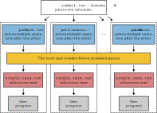

Other Tools
===========

`Français <../fr/other_tools.html>`_

GLOST
-----

`GLOST <https://docs.alliancecan.ca/wiki/GLOST/en>`__ (for *Greedy Launcher
of Small Tasks*) is a tool that behaves somewhat like :doc:`gnu_parallel` when
given a command file. Here is what distinguishes the two tools:

===========  ===============================  ================================
  Feature            GNU Parallel                        GLOST
===========  ===============================  ================================
Command      ``parallel < cmd.txt``           ``srun glost_launch cmd.txt``
Slurm job    Typically on a single node       Distributed processes (MPI)
``sbatch``   ``--nodes=1 --cpus-per-task=N``  ``--ntasks=N --cpus-per-task=1``
===========  ===============================  ================================

From the above table, we understand that GLOST uses an `MPI (Message Passing
Interface) job
<https://docs.alliancecan.ca/wiki/Running_jobs#MPI_job>`__ to run
**exclusively serial commands** listed in a text file. The ``glost_launch``
program is an MPI program that uses a manager-worker architecture:

- The manager process (index 0 in the figure below) distributes the serial
  commands to the workers one at a time until none remain.
- Available worker processes ask for a command to execute and either get one or
  are instructed to quit.

.. figure:: ../images/glost-mpi.svg

For this section, go to the example directory with:

.. code-block:: bash

    cd ~/cq-formation-cip202-main/lab/gnu-parallel

To use GLOST, we must first load a module:

.. code-block:: bash

    module load glost/0.3.1

Then, we can directly test using four processes (``-n, --ntasks``) and one core
per process (``-c, --cpus-per-task``):

.. code-block:: bash

    [alice@narval1 gnu-parallel]$ srun -n 4 -c 1 glost_launch cmd.txt
    srun: job 41153816 queued and waiting for resources
    srun: job 41153816 has been allocated resources
    #executed by process  2 in 0.006s with status  0 : echo $((3*6)) > prod_3x6
    #executed by process  3 in 0.006s with status  0 : echo $((5*4)) > prod_5x4
    #executed by process  1 in 0.007s with status  0 : echo $((3*4)) > prod_3x4
    #executed by process  2 in 0.006s with status  0 : echo $((5*6)) > prod_5x6
    #executed by process  3 in 0.006s with status  0 : echo $((5*8)) > prod_5x8
    #executed by process  1 in 0.008s with status  0 : echo $((7*6)) > prod_7x6
    #executed by process  2 in 0.005s with status  0 : echo $((7*8)) > prod_7x8

In the above example, only three of the four processes actually performed
computations. Thanks to the reported exit code (``status 0`` if everything went
well), it is possible to identify failed commands to rerun in a later GLOST job.

.. note::

    An exit code is an integer number returned by a program upon termination.
    All programs return an exit code, even if they “crash” or generate errors.
    By convention, a zero exit code indicates that the program completed
    successfully; any other value indicates an error. The exit code of the last
    run command is available with ``$?``.

META-Farm
---------

`META-Farm <https://docs.alliancecan.ca/wiki/META-Farm/en>`__ (or, simply, META)
is an advanced tool for data parallelism on clusters that use the Slurm job
scheduler. It combines some of the features of job arrays and GNU Parallel for
increased flexibility. Its usage is, however, more complex than that of the
tools we have seen up to now. Consider META if your project makes intensive use
of data parallelism. This tool was designed by the SHARCNET team (Ontario) and
works on all Alliance national clusters.

META uses a specific vocabulary:

- *Case*: an individual calculation. It could be a serial or parallel
  calculation, on CPU or GPU.
- *Farm*: a group of calculations (*cases*) to complete.
- *Job*: a compute job in the Slurm scheduler.

If we apply this vocabulary to job arrays, we could say that each case in a farm
is treated in a different job; there are as many jobs as cases. With GNU
Parallel, conversely, all cases in a farm are treated using a single job. META
can do both and even use an intermediate strategy, called META mode.

META mode is illustrated in the figure below. When beginning the processing of a
farm with ``submit.run``, the number of jobs :math:`N` to submit to the
scheduler is given. When the first of these jobs starts, it begins solving the
first case. As soon as this case is solved, the job proceeds to the next one.
As the other jobs start, they also solve one case at a time. Once all cases
are solved, all jobs immediately stop.

This process combines advantages from job arrays and GNU Parallel. As with
arrays, it is possible to have multiple jobs running simultaneously in the
scheduler, which increases computing throughput. As with GNU Parallel, it is
possible to efficiently combine short computations into a single job, which
avoids overloading the scheduler.

META offers other features, such as resubmitting failed cases automatically and
running a post-processing job once all cases in a farm have been solved.

Demonstration
'''''''''''''

1. Load the software module
...........................

.. code-block:: console

    [alice@narval3 ~]$ module load meta-farm/1.0.3

2. Create a farm
................

Each farm corresponds to a directory, created using the META command
``farm_init.run``.

.. code-block:: console

    [alice@narval3 ~]$ farm_init.run hello
    Success!
    [alice@narval3 ~]$ cd hello/

That command also added to the directory the files that are used to configure
the farm and its cases.

.. code-block:: console

    [alice@narval3 hello]$ ls
    config.h  job_script.sh  resubmit_script.sh  single_case.sh  table.dat

3. Configure the cases and the jobs
...................................

The ``table.dat`` file lists the cases, one per line. The default ``table.dat``
contains 1300 cases. Each case calls the ``sleep`` command with a random
argument.

.. code-block:: console

    [alice@narval3 hello]$ wc -l table.dat 
    1300 table.dat
    [alice@narval3 hello]$ head table.dat 
    sleep 26
    sleep 26
    sleep 28
    sleep 30
    sleep 29
    sleep 25
    sleep 25
    sleep 28
    sleep 27
    sleep 29

To simplify this example, we will retain only the first 18 cases.

.. code-block:: console

    [alice@narval3 hello]$ head -n 18 table.dat > subset.dat
    [alice@narval3 hello]$ mv subset.dat table.dat

File ``job_script.sh`` contains the ``#SBATCH`` instructions that will be
applied to each of the :math:`N` jobs submitted to the scheduler. This file must
be edited to at least set the required time and account to use. If your cases
use a parallel or GPU program, request the necessary resources in this file.
This example uses a serial program (``sleep``) that requires no particular
resources.

.. code-block:: console

    #!/bin/bash

    #SBATCH --time=01:00:00
    #SBATCH --account=def-sponsor

    # Don’t change the lines below
    #=================================================================
    [...]

.. note::

    The ``--time`` option in ``job_script.sh`` must be set to the time necessary
    for solving all the cases in a job, not the time necessary for a single
    case. This time :math:`t` must be computed as a function of the total number
    of cases (:math:`M`), the average time required for one case
    (:math:`\bar{t_i}`), and the chosen number of jobs (:math:`N`):

    .. math::

        t = \frac{M \, \bar{t_i}}{N}

4. Submit the jobs
..................

The number of jobs :math:`N` is given to the META command ``submit.run``, which
submits the jobs to the scheduler.

.. code-block:: console

    [alice@narval3 hello]$ submit.run 2
    Submitting 18 cases from table.dat as 2 jobs using META mode

    Submitting the farm as an Array Job

    Success!
    [alice@narval3 hello]$ sq
              JOBID     USER      ACCOUNT           NAME  ST  TIME_LEFT NODES CPUS TRES_PER_N MIN_MEM NODELIST (REASON) 
         41169148_1    alice  def-sponsor          hello   R      59:10     1    1        N/A      4G nc31004 (None) 
         41169148_2    alice  def-sponsor          hello   R      59:10     1    1        N/A      4G nc31004 (None)

The ``table.dat`` file is modified when the tasks are submitted, to set an index
for each case.

.. code-block:: console

    [alice@narval3 hello]$ head table.dat
    1 sleep 26
    2 sleep 26
    3 sleep 28
    4 sleep 30
    5 sleep 29
    6 sleep 25
    7 sleep 25
    8 sleep 28
    9 sleep 27
    10 sleep 29

5. Check results
................

To each case corresponds a ``RUN*`` directory. (In this example, the directories
are empty since ``sleep`` generates no results.) The output files for the Slurm
jobs themselves are in ``OUTPUT``. Finally, the files in ``STATUSES`` give the
reported exit code for each case; this allows identifying eventual failed cases
and resubmitting them.

.. code-block:: console

    [alice@narval3 hello]$ ls
    config.h       resubmit_script.sh  RUN12  RUN16  RUN3  RUN7            STATUSES
    job_script.sh  RUN1                RUN13  RUN17  RUN4  RUN8            table.dat
    MISC           RUN10               RUN14  RUN18  RUN5  RUN9            TMP
    OUTPUT         RUN11               RUN15  RUN2   RUN6  single_case.sh
    [alice@narval3 hello]$ ls OUTPUT/
    slurm-41169148.out  slurm-41169153.out
    [alice@narval3 hello]$ ls STATUSES/
    status.41169148_1  status.41169148_2
    [ofisette@narval3 hello]$ cat STATUSES/status.41169148_1
    1 0
    3 0
    6 0
    8 0
    10 0
    12 0
    14 0
    15 0
    18 0

Find out more
'''''''''''''

- Alliance technical documentation: `META-Farm
  <https://docs.alliancecan.ca/wiki/META-Farm/en>`__
- Webinar: `META: running a large number of jobs conveniently
  <https://www.youtube.com/watch?v=GcYbaPClwGE>`__
