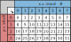

Vecteurs de tâches
==================

`English <../en/job_arrays.html>`_

Les `vecteurs de tâches <https://docs.alliancecan.ca/wiki/Job_arrays/fr>`_ sont
une fonctionnalité de l’ordonnanceur Slurm. Ils permettent d’utiliser le même
script pour soumettre plusieurs tâches avec une seule commande.

Les vecteurs sont l’outil idéal lorsque :

- Vous avez plusieurs tâches similaires à soumettre.
- Celles-ci ne sont pas trop courtes (au moins une heure de temps demandé).
- Leur nombre n’excède pas un millier.

Pour les tâches plus courtes ou plus nombreuses, l’outil :doc:`../gnu_parallel`
devrait plutôt être utilisé.

Les bases
---------

Le script ``hello-job.sh`` suivant est un exemple minimal d’un vecteur de
tâches :

.. code-block:: bash
    :emphasize-lines: 4,6

    #!/bin/bash

    #SBATCH --job-name=hello
    #SBATCH --array=1-10

    echo "Hello from index $SLURM_ARRAY_TASK_ID"

    sleep 60

Un script pour un vecteur de tâches contient l’option ``--array``, qui spécifie
les répétitions de la tâche et assigne à chacune une valeur entière unique, ici
de 1 à 10. Cet index est accessible avec ``$SLURM_ARRAY_TASK_ID``.

Ce script peut être soumis comme n’importe quel autre :

.. code-block:: console

    [alice@narval1 hello-array]$ sbatch hello-job.sh
    Submitted batch job 40912550

Toutefois, cette commande crée 10 tâches dans l’ordonnanceur plutôt qu’une
seule :

.. code-block:: console

    [alice@narval1 hello-array]$ sq
              JOBID     USER      ACCOUNT           NAME  ST  TIME_LEFT NODES CPUS TRES_PER_N MIN_MEM NODELIST (REASON) 
    40912550_[4-10]    alice  def-sponsor my-first-array  PD    1:00:00     1    1        N/A    256M          (Priority)
         40912550_1    alice  def-sponsor my-first-array   R      59:57     1    1        N/A    256M nc10914  (None) 
         40912550_2    alice  def-sponsor my-first-array   R      59:57     1    1        N/A    256M nc10914  (None) 
         40912550_3    alice  def-sponsor my-first-array   R      59:57     1    1        N/A    256M nc10914  (None)

Chaque tâche est identifiée par son index et est indépendante des autres. Ainsi,
certaines tâches peuvent démarrer tandis que d’autres attendent dans la file.

Chaque tâche a son propre fichier de sortie, à nouveau identifié par son index :

.. code-block:: console

    [alice@narval1 hello-array]$ ls slurm-*.out
    slurm-40912550_1.out  slurm-40912550_2.out  slurm-40912550_3.out
    [alice@narval1 hello-array]$ grep Hello slurm-*.out
    slurm-40912550_1.out:Hello from index 1
    slurm-40912550_2.out:Hello from index 2
    slurm-40912550_3.out:Hello from index 3

On peut annuler une des tâches du vecteur avec son index :

.. code-block:: console

    [alice@narval1 ~]$ scancel -j 40912550_5

Ou un sous-ensemble des tâches :

.. code-block:: console

    [alice@narval1 ~]$ scancel -j 40912550_[6-10]

Ou encore toutes les tâches du vecteur :

.. code-block:: console

    [alice@narval1 ~]$ scancel -j 40912550

Exercice
''''''''

#. Allez dans le répertoire contenant le script montré ci-haut : ``cd
   ~/cq-formation-cip202-main/lab/hello-array``.
#. Affichez le contenu du script avec ``cat hello-job.sh``.
#. Soumettez le script avec ``sbatch`` et suivez les tâches avec ``sq``.
#. Quand toutes les tâches sont terminées, affichez les fichiers de sortie avec
   ``ls`` et ``cat``.

Pourquoi utiliser un vecteur ?
''''''''''''''''''''''''''''''

Plutôt que d’utiliser un vecteur, il serait possible de soumettre, manuellement
ou à l’aide d’une boucle automatisée, des dizaines ou des centaines de scripts
de tâches. Cette approche est à proscrire :

- Des appels rapides et répétés à ``sbatch`` surchargent l’ordonnanceur.
- Maintenir de nombreuses copies de votre script de tâche est plus compliqué et
  source d’erreurs.

Utiliser les vecteurs
---------------------

Les index des tâches à soumettre peuvent être contrôlés avec précision. Voici
quelques exemples :

- ``--array=1-10`` : De 1 à 10
- ``--array=1-9:2`` : 1, 3, 5, 7 et 9 (un pas de 2)
- ``--array=1,2,5`` : 1, 2 et 5

La syntaxe du dernier exemple est particulièrement utile pour re-soumettre une
ou plusieurs tâches ayant échoué. Pour ce faire, ``sbatch --array`` peut être
utilisé plutôt que de modifier le script de tâche :

.. code-block:: console

    [alice@narval1 ~]$ sbatch --array=1,2,5 job.sh

Finalement, il est possible de limiter le nombre de tâches pouvant être
actives simultanément :

- ``--array=1-1000%10`` : Au plus 10 tâches peuvent être actives simultanément.
- ``--array=1-25%1`` : Ne démarre qu’une seule tâche à la fois.

Le premier exemple est utile pour limiter le débit de vos tâches afin d’éviter
que les autres membres de votre groupe de recherche ne voient la priorité de
leurs tâches sévèrement diminuée si vous soumettez un grand nombre de tâches.

La variable ``SLURM_ARRAY_TASK_ID`` donne l’index associé à une tâche. Elle est
utilisée dans le script afin de distinguer les tâches. On l’utilise pour :

- Choisir un jeu de données d’entrée (e.g. molécule 1, 2, 3…).
- Déterminer la valeur d’un paramètre à tester.
- Numéroter un fichier de sortie.

Par exemple, si vous aviez des fichiers d’entrée nommés ``mol-1.pdb``,
``mol-2.pdb``, ``mol-3.pdb``, ``...``, vous pourriez y faire référence dans
votre script avec :

.. code-block:: bash

    ./prog --input "mol-$SLURM_ARRAY_TASK_ID.pdb"

La longueur de la variable ``SLURM_ARRAY_TASK_ID`` peut rendre le script de
tâche difficile à lire, particulièrement lorsque la variable est utilisée
plusieurs fois. Pour cette raison, il est fréquent d’aliaser
``SLURM_ARRAY_TASK_ID`` à un nom court :

.. code-block:: bash

    i=$SLURM_ARRAY_TASK_ID

    ./prog --input "mol-$i.pdb" --output "stats-$i.dat"

Il est fréquent d’avoir des fichiers nommés avec des zéros non significatifs,
par exemple ``mol-001.pdb``, ``...``, ``mol-099.pdb``, ``mol-100.pdb``. L’index
de la tâche doit alors être converti en une chaîne de caractères remplie avec
des zéros :

.. code-block:: bash

    i=$(printf %03d $SLURM_ARRAY_TASK_ID)

    ./prog --input "mol-$i.pdb" --output "stats-$i.dat"

.. note::

    ``printf`` affiche une ou plusieurs valeurs selon un *format*, ici
    ``%03d`` :

    - ``%`` : Débute le formattage d’une valeur
    - ``0`` : Remplit avec des zéros non significatifs
    - ``3`` : Produit une chaîne de trois caractères
    - ``d`` : Interprète la valeur comme un nombre entier

    La syntaxe ``$(cmd)``, pour sa part, est une *substitution de commande*.
    Ici, la sortie de ``cmd`` est utilisée pour définir la valeur de ``i``.

Exercice
''''''''

**Objectifs**

- Convertir un script de tâche standard en un script pour un vecteur de tâches.
- Soumettre un vecteur de tâches qui produit dix fichiers numérotés.

**Instructions**

#. Familiarisez-vous avec le script de tâche initial qui produit un fichier
   contenant des nombres aléatoires tirés d’une distribution normale.

   #. Allez dans le répertoire de l’exercice avec
      ``cd ~/cq-formation-cip202-main/lab/dist-array``.
   #. Affichez le script de tâche avec ``cat dist-job-single.sh``.
   #. Soumettez le script avec ``sbatch dist-job-single.sh``.
   #. Une fois la tâche terminée, vérifiez que le fichier de sortie a bien été
      créé avec ``ls results``.

#. Modifiez le script pour en faire un vecteur de tâches.

   #. Copiez-le sous un autre nom : ``cp dist-job-single.sh dist-job-array.sh``.
   #. Éditez le nouveau script avec ``nano dist-job-array.sh``.
   #. Ajoutez l’option ``--array`` pour créer un vecteur de 10 tâches.
   #. Utilisez ``SLURM_ARRAY_TASK_ID`` pour contrôler le nom du fichier de
      sortie.
   #. Optionnellement, utilisez ``printf`` pour produire des fichiers de sortie
      dont les noms ont tous le même nombre de caractères.

#. Soumettez le script avec ``sbatch``.
#. Une fois les tâches terminées, vérifiez que les dix fichiers de sortie ont
   bien été créés.

**Solution**

- Comparez votre script avec ``solution/distrib-job-array.sh``.
- La version ``solution/distrib-job-array-padded.sh`` ajoute des zéros non
  significatifs.

Vecteurs complexes
------------------

Vecteurs de tâches parallèles
'''''''''''''''''''''''''''''

Les vecteurs de tâches que nous avons vus jusqu’à maintenant répétaient tous une
tâche sérielle. Toutefois, n’importe quelle tâche peut être répétée au moyen
d’un vecteur, incluant les tâches parallèles.

Les ressources (temps, mémoire, cœurs CPU) demandées quand on soumet un vecteur
s’appliquent à chaque tâche et non globalement. Par exemple, pour exécuter un
programme MPI 10 fois avec 8 cœurs CPU chaque fois, le script suivant demande 8
cœurs et non 80 :

.. code-block:: bash
    :emphasize-lines: 5,8

    #!/bin/bash

    #SBATCH --job-name=param-sweep
    #SBATCH --nodes=1
    #SBATCH --ntasks-per-node=8
    #SBATCH --mem-per-cpu=2G
    #SBATCH --time=6:00:00
    #SBATCH --array=1-10

    srun ./prog --param=$SLURM_ARRAY_TASK_ID

Vecteurs 2D
'''''''''''

Il arrive parfois que l’on souhaite varier plus d’un paramètre dans un vecteur
de tâches. Par exemple, si vous étudiez 8 médicaments potentiels et 4 récepteurs
protéiques, vous pourriez vouloir tester les 32 combinaisons
médicament/récepteur possibles. Toutefois, Slurm ne permet pas de définir de
multiples variables avec l’option ``--array`` ; on ne peut que donner une
séquence d’index. Que faire ?

Il existe plusieurs solutions possibles à ce problème, mais toutes utilisent la
même stratégie : convertir un index linéaire :math:`i` en une paire d’index
:math:`(x,y)`. Donnons au médicament l’index :math:`x \in [0..7]` et au
récepteur l’index :math:`y \in [0..3]` ; l’index linéaire, pour sa part, sera
:math:`i \in [0..31]` :

Pour convertir :math:`i → (x,y)`, on utilise la division entière,
:math:`\text{div}`, et le reste (ou modulo), :math:`\text{mod}`. Ces conversions
peuvent être faites dans le script de tâche :

.. code-block:: bash
    :emphasize-lines: 7-8

    #!/bin/bash

    #SBATCH --array=0-31

    i=$SLURM_ARRAY_TASK_ID

    x=$((i % 8))  # mod
    y=$((i / 8))  # div

    echo "Testing drug candidate $x vs receptor $y"

.. note::

    La syntaxe ``$((expr))`` est une *expansion arithmétique*, qui permet
    d’effectuer des calculs simples (limités aux entiers).

Vecteurs n-dimensionnels
''''''''''''''''''''''''

Lorsque le nombre de paramètres à traiter dépasse deux, convertir l’index
linéaire :math:`i` en index multidimensionnels avec des divisions entières et le
modulo devient fastidieux. Il existe une alternative simple : créer un fichier
contenant toutes les combinaisons de paramètres à traiter, une combinaison par
ligne. Le numéro de ligne dans le fichier devient l’index linéaire :math:`i`.
Pour convertir :math:`i → (x,y,z,...)`, il suffit de lire les valeurs à la
ligne correspondante.

Par exemple, supposons que vous simulez la stabilité de deux protéines à trois
températures différentes avec et sans un agent stabilisant. Un fichier
``params.txt`` contenant les 12 combinaisons possibles de ces paramètres peut
être créé avec le script ``make-params.sh`` suivant :

.. code-block:: bash

    #!/bin/bash

    proteins="A B"
    temperatures="30 37 44"

    rm -f params.txt

    for prot in $proteins; do
        for temp in $temperatures; do
            for agent in true false; do
                echo $prot $temp $agent >> params.txt
            done
        done
    done

.. code-block:: console

    [alice@narval1 ~]$ bash make-params.sh
    [alice@narval1 ~]$ cat params.txt
    A 30 true
    A 30 false
    A 37 true
    A 37 false
    A 44 true
    A 44 false
    B 30 true
    B 30 false
    B 37 true
    B 37 false
    B 44 true
    B 44 false

Le script du vecteur de tâches lit une ligne de ce fichier :

.. code-block:: bash
    :emphasize-lines: 7

    #!/bin/bash

    #SBATCH --array=1-12

    i=$SLURM_ARRAY_TASK_ID

    read prot temp agent <<< $(sed "${i}q;d" params.txt)

    echo "Loading structure for protein $prot"
    echo "Setting temperature to $temp degrees"
    if $agent; then
        echo "Adding stabilizing agent"
    fi

.. note::

    La commande ``sed`` (*stream editor*) est un outil de manipulation de texte.
    Il est utilisé ici pour lire la ligne ``${i}`` du fichier de paramètres. La
    syntaxe ``<<<`` est une chaîne en ligne (*here string*) : la sortie de
    ``sed`` est redirigée vers la commande ``read``, qui assigne les valeurs aux
    variables ``prot``, ``temp`` et ``agent``.
    
    Un tube tel que ``sed [...] | read [...]`` ne pourrait être utilisé ici car
    les tubes sont exécutés dans un sous-processus qui n’a pas accès aux
    variables du processus parent, soit celui qui exécute le script. Les valeurs
    lues seraient alors immédiatement perdues.

En plus d’être simple, cette approche des vecteurs de tâches multidimensionnels
est flexible :

- Elle fonctionne peu importe le nombre de paramètres.
- Le nombre de paramètres peut être changé aisément.
- N’importe quelles combinaisons de paramètres peuvent être choisies.

  - Cela permet, entre autres, d’éviter de traiter des combinaisons que l’on
    sait impossible. Par exemple, si vous simulez un modèle avec différentes
    combinaisons de températures et de niveaux d’humidité mais que vous ne vous
    intéressez qu’aux conditions au-dessus du point de rosée, vous pouvez
    éliminer à l’avance les combinaisons température/humidité que vous savez
    être en dessous de ce point, simplement en ne les ajoutant pas à votre
    fichier de paramètres.

Pour en savoir plus
-------------------

- Documentation technique de l’Alliance : `Vecteurs de tâches
  <https://docs.alliancecan.ca/wiki/Job_arrays/fr>`_
- Documentation de Slurm : `Job Array Support
  <https://slurm.schedmd.com/job_array.html>`_
- Webinaire : `Automating the GROMACS analysis tools on HPC systems
  <https://raw.githubusercontent.com/WestGrid/trainingMaterials/gh-pages/materials/gmxtools.pdf>`_
