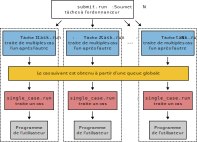

Autres outils
=============

`English <../en/other_tools.html>`_

GLOST
-----

Présentation ...

META-Farm
---------

`META-Farm <https://docs.alliancecan.ca/wiki/META-Farm/fr>`__ (ou, simplement,
META) est un outil avancé pour le parallélisme de données sur les grappes de
calcul qui utilisent l’ordonnanceur de tâches Slurm. Il combine certaines des
capacités des vecteurs de tâches et de GNU Parallel pour une flexibilité accrue.
Son utilisation est toutefois plus complexe que celle des outils que nous avons
vus jusqu’à maintenant. Considérez META si votre projet utilise intensivement le
parallélisme de données. Cet outil a été conçu par l’équipe de SHARCNET
(Ontario) et fonctionne sur toutes les grappes nationales de l’Alliance.

META utilise un vocabulaire spécifique :

- *Cas* (*case*) : un calcul individuel. Il peut s’agir d’un calcul sériel ou
  parallèle, sur CPU ou GPU.
- *Groupe de cas* (*farm*) : un ensemble de calculs (*cas*) à compléter.
- *Tâche* (*task*) : une tâche de calcul dans l’ordonnanceur Slurm.

Si l’on applique ce vocabulaire aux vecteurs de tâches, on pourrait dire que
chaque cas d’un groupe est traité dans une tâche ; il y a autant de tâches que
de cas. Avec GNU Parallel, inversement, tous les cas d’un groupe sont traités
dans une seule tâche. META permet de faire l’un ou l’autre ou même d’utiliser
une stratégie intermédaire, le mode META.

Le fonctionnement du mode META est illustré dans la figure ci-dessous. Lorsque
le traitement d’un groupe de cas est débuté avec ``submit.run``, on spécifie le
nombre :math:`N` de tâches à soumettre à l’ordonnanceur Slurm. Lorsque la
première de ces tâches démarre, elle débute le premier cas. Dès que son
traitement est terminé, la tâche passe au cas suivant. À mesure que les autres
tâches démarrent, elles aussi traitent un cas à la fois. Lorsque tous les cas
sont résolus, toutes les tâches s’arrêtent aussitôt.

Cette façon de faire combine des avantages des vecteurs de tâches et de GNU
Parallel. Comme avec les vecteurs, il est possible d’avoir plusieurs tâches
actives en même temps dans l’ordonnanceur, ce qui augmente le débit de calcul.
Comme avec GNU Parallel, il est possible de combiner efficacement des calculs
courts dans une seule tâche, ce qui évite de surcharger l’ordonnanceur.

META offre d’autres fonctionnalités comme la resoumission automatique des cas
qui ont échoué et l’exécution d’une tâche de post-traitement lorsqu’un groupe de
cas est completé.

Démonstration
'''''''''''''

1. Charger le module logiciel
.............................

.. code-block:: console

    [alice@narval3 ~]$ module load meta-farm/1.0.2

2. Créer un groupe de cas
.........................

À chaque groupe de cas correspond un répertoire, créé par la commande META
``farm_init.run``.

.. code-block:: console

    [alice@narval3 ~]$ farm_init.run hello
    Success!
    [alice@narval3 ~]$ cd hello/

Cette même commande ajoute au répertoire les fichiers nécessaires pour
configurer le groupe et les cas.

.. code-block:: console

    [alice@narval3 hello]$ ls
    config.h  job_script.sh  resubmit_script.sh  single_case.sh  table.dat

3. Configurer les cas et les tâches
...................................

Le fichier ``table.dat`` liste les cas, un par ligne, avec un numéro de cas dans
la première colonne.

.. code-block:: console

    [alice@narval3 hello]$ cat table.dat 
    1 sleep 30
    2 sleep 35
    3 sleep 40
    4 sleep 25
    5 sleep 31
    6 sleep 33
    7 sleep 28
    8 sleep 43
    9 sleep 29
    10 sleep 28
    11 sleep 39
    12 sleep 27
    13 sleep 31
    14 sleep 24
    15 sleep 44
    16 sleep 33
    17 sleep 28
    18 sleep 29

Il y a 18 cas dans cet exemple qui utilise le fichier ``table.dat`` créé par
défaut. Chaque cas appelle la commande ``sleep`` avec un argument différent.

Le fichier ``job_script.sh`` contient les instructions ``#SBATCH`` qui seront
appliquées à chacune des :math:`N` tâches soumises à l’ordonnanceur. Ce fichier
doit être édité pour indiquer au moins le temps nécessaire et le compte à
utiliser. Si vos cas utilisent un programme parallèle ou un GPU, demandez les
ressources nécessaires dans ce fichier. Cet exemple utilise un programme sériel
(``sleep``) qui ne demande aucune ressource particulière :

.. code-block:: console

    #!/bin/bash
    #SBATCH --time=01:00:00
    #SBATCH --account=def-sponsor

    # Don’t change this line:
    task.run

.. note::

    L’option ``--time`` dans le fichier ``job_script.sh`` doit être réglée en
    fonction du temps nécessaire pour tous les cas qui seront traités par une
    tâche et non en fonction du temps nécessaire pour un seul cas. Ce temps
    :math:`t` doit être calculé en fonction du nombre total de cas, :math:`M`,
    du temps moyen nécessaire pour un cas, :math:`t_i`, et du nombre de tâches
    :math:`N` choisi :

    .. math::

        t = \frac{M t_i}{N}

4. Soumettre les tâches
.......................

Le nombre :math:`N` de tâches est donné à la commande META ``submit.run``, qui
soumet ces tâches à l’ordonnanceur :

.. code-block:: console

    [alice@narval3 hello]$ submit.run 2
    [alice@narval3 hello]$ sq
              JOBID     USER      ACCOUNT           NAME  ST  TIME_LEFT NODES CPUS TRES_PER_N MIN_MEM NODELIST (REASON) 
         41169148_1    alice  def-sponsor          hello   R      59:10     1    1        N/A      4G nc31004 (None) 
         41169148_2    alice  def-sponsor          hello   R      59:10     1    1        N/A      4G nc31004 (None)

5. Consulter les résultats
..........................

À chaque cas correspond un répertoire ``RUN*``. (Dans cet exemple, les
répertoires sont vides car le programme ``sleep`` ne génère aucun résultat.) Les
fichiers de sortie des tâches Slurm elles-mêmes sont dans ``OUTPUT``. Enfin, les
fichiers dans ``STATUSES`` donnent le code de sortie rapporté pour chaque cas ;
cela permet d’identifier d’éventuels cas ayant échoué et de les resoumettre.

.. code-block:: console

    [alice@narval3 hello]$ ls
    config.h       resubmit_script.sh  RUN12  RUN16  RUN3  RUN7            STATUSES
    job_script.sh  RUN1                RUN13  RUN17  RUN4  RUN8            table.dat
    MISC           RUN10               RUN14  RUN18  RUN5  RUN9            TMP
    OUTPUT         RUN11               RUN15  RUN2   RUN6  single_case.sh
    [alice@narval3 hello]$ ls OUTPUT/
    slurm-41169148.out  slurm-41169153.out
    [alice@narval3 hello]$ ls STATUSES/
    status.41169148_1  status.41169148_2
    [ofisette@narval3 hello]$ cat STATUSES/status.41169148_1
    1 0
    3 0
    6 0
    8 0
    10 0
    12 0
    14 0
    15 0
    18 0

Pour en savoir plus
'''''''''''''''''''

- Documentation technique de l’Alliance : `META-Farm
  <https://docs.alliancecan.ca/wiki/META-Farm/fr>`__
- Webinaire : `META: running a large number of jobs conveniently
  <https://www.youtube.com/watch?v=GcYbaPClwGE>`__
